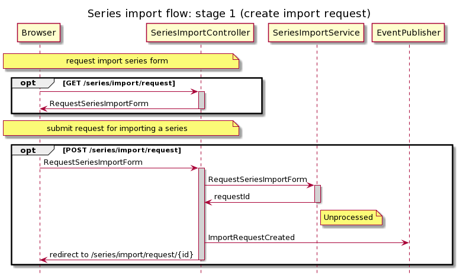
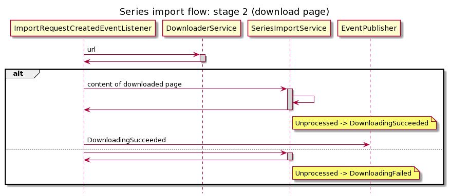
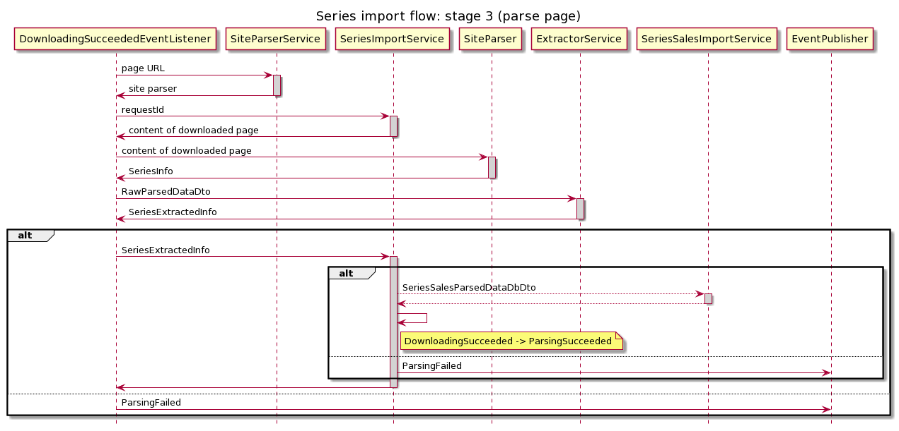
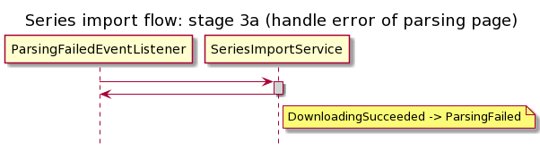
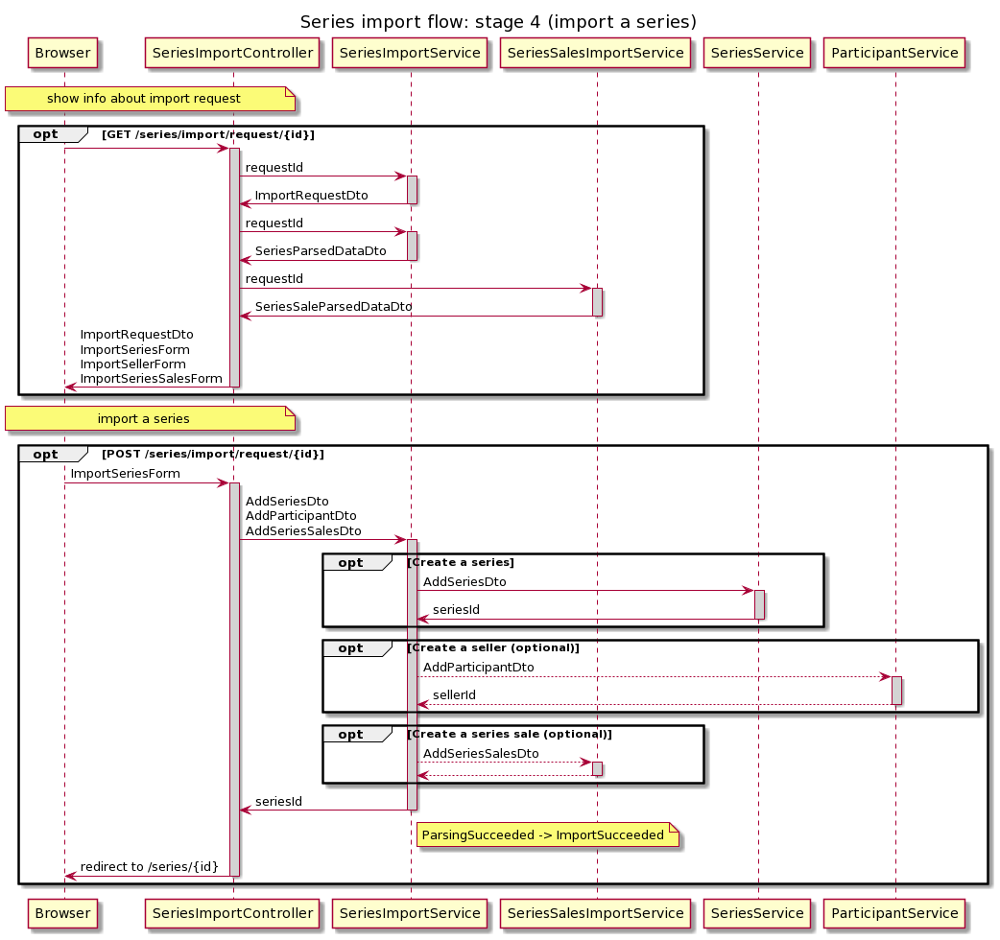

# Import a series from another resource

Importing a series from another resource is a 4-stages process:
1. [Create import request](#create-import-request): user with sufficient
   privileges submits request for the import to the system
1. [Download page](#download-page): the system downloads requested page and
   saves its content to database
1. [Parse page](#parse-page): the system parses downloaded page, extracts
   information out of page content and also saves this information to database
1. [Import a series](#import-a-series): user views extracted information,
   provides missing fragments, and confirm import. The system creates a new
   series.

## Create import request

## Download page

## Parse page

## Import a series

